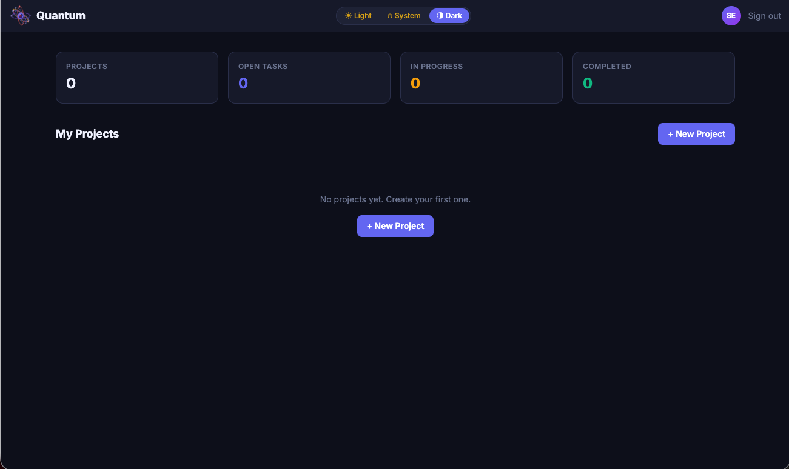
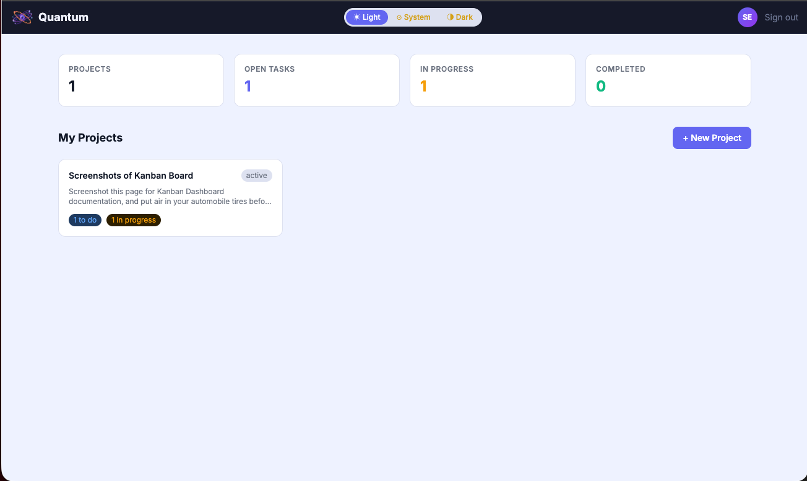
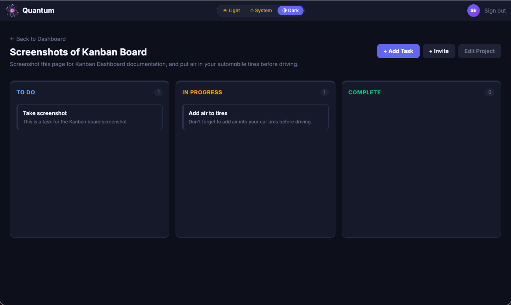
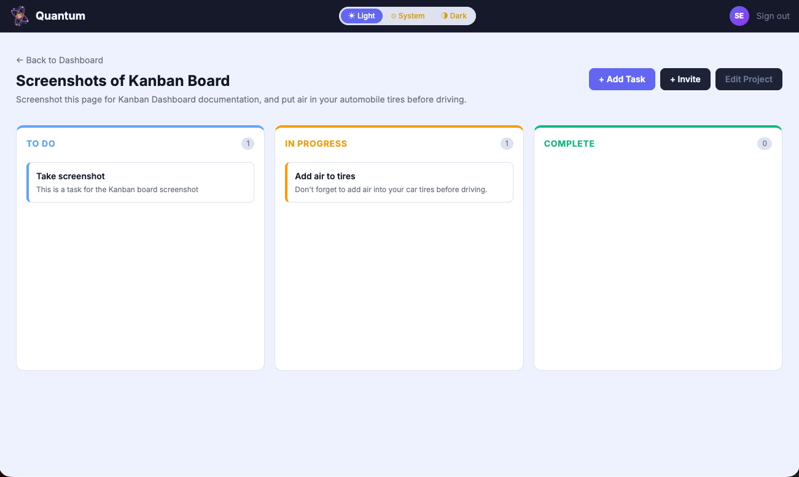
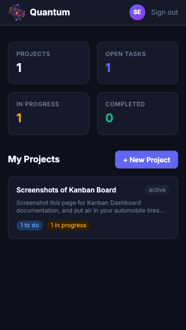
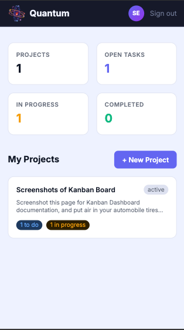

#  Quantum


Quantum is a modern, full-stack MERN project management application built for individuals and small teams. It features secure JWT-based authentication, ownership-based authorization, and a RESTful API for managing projects and tasks — deployed and production-ready. The interface is designed around a dark-first aesthetic inspired by quantum physics, with a fully responsive Kanban board, real-time drag-and-drop, and light/dark/system theme switching.

## Table of Contents

- [Live Demo](#live-demo)
- [Screenshots](#screenshots)
- [Vision](#vision)
- [Tech Stack](#tech-stack)
- [Key Technical Decisions](#key-technical-decisions)
- [Project Structure](#project-structure)
- [Getting Started](#getting-started)
- [Environment Variables](#environment-variables)
- [Environments](#environments)
- [API Endpoints](#api-endpoints)
  - [Auth](#auth)
  - [Projects](#projects)
  - [Tasks](#tasks)
- [Authentication Flow](#authentication-flow)
- [Authorization Flow](#authorization-flow)
- [Task Authorization Chain](#task-authorization-chain)
- [Data Model Relationships](#data-model-relationships)
- [Error Responses](#error-responses)
- [Roadmap](#roadmap)
- [Security Features](#security-features)
- [Two-Factor Authentication](#two-factor-authentication)
- [Testing & Development Tools](#testing--development-tools)
- [References](#references)
  - [Core Stack — Backend](#core-stack--backend)
  - [Core Stack — Frontend](#core-stack--frontend)
  - [Standards](#standards)
  - [Development Tools](#development-tools)
  - [Video References](#video-references)
  - [Deployment](#deployment)
- [Authentication & Security](#authentication--security)
- [License](#license)

## Live Demo

🚀 **[Launch Quantum](https://quantum-client.onrender.com)**

> The backend runs on Render's free tier and may take 30–60 seconds to wake up on first request.

## Screenshots

**Dashboard**

<table>
  <tr>
    <td></td>
    <td></td>
  </tr>
  <tr>
    <td align="center">Dark Mode</td>
    <td align="center">Light Mode</td>
  </tr>
</table>

**Kanban Board**

<table>
  <tr>
    <td></td>
    <td></td>
  </tr>
  <tr>
    <td align="center">Dark Mode</td>
    <td align="center">Light Mode</td>
  </tr>
</table>

**Mobile**

<table>
  <tr>
    <td></td>
    <td></td>
  </tr>
  <tr>
    <td align="center">Dark Mode</td>
    <td align="center">Light Mode</td>
  </tr>
</table>

## Vision

Quantum was built to explore what a modern, production-ready project management tool looks like when designed with intention — dark-first UI, collaborative workflows, and quantum physics as a visual language for the complexity of coordinating teams and tasks. Every design decision, from the indigo color palette to the orbital logo animation, reflects a belief that developer tools should feel as polished as the products they help build.

## Tech Stack

**Frontend**

- [React 19](https://react.dev/) — UI library
- [TypeScript](https://www.typescriptlang.org/) — typed JavaScript
- [Vite](https://vitejs.dev/) — build tool and dev server
- [React Router](https://reactrouter.com/) — client-side routing
- [Axios](https://axios-http.com/) — HTTP client for API requests
- [Tailwind CSS](https://tailwindcss.com/) — utility-first styling
- [Framer Motion](https://www.framer.com/motion/) — animations
- [Lucide React](https://lucide.dev/guide/packages/lucide-react) — icon library
- [@dnd-kit](https://dndkit.com/) — drag-and-drop task board

**Backend**

- [Node.js](https://nodejs.org/) — runtime environment
- [Express 5](https://expressjs.com/) — web framework
- [MongoDB](https://www.mongodb.com/) — NoSQL database
- [Mongoose](https://mongoosejs.com/) — MongoDB object modeling
- [dotenv](https://github.com/motdotla/dotenv) — environment variable management
- [cors](https://github.com/expressjs/cors) — cross-origin resource sharing
- [JSON Web Tokens](https://jwt.io/) — authentication
- [bcryptjs](https://github.com/dcodeIO/bcrypt.js) — password hashing
- [otplib](https://github.com/yeojz/otplib) — TOTP one-time password generation and verification
- [qrcode](https://github.com/soldair/node-qrcode) — QR code generation for authenticator app setup
- [morgan](https://github.com/expressjs/morgan) — HTTP request logger
- [nodemon](https://nodemon.io/) — development server with auto-restart

## Key Technical Decisions

**TypeScript over JavaScript** — Type safety across the entire client prevents entire categories of runtime errors. TypeScript's indexed access types (`Task['status']`) and type assertions were particularly valuable for the Kanban board's status management.

**Express 5 over Express 4** — Express 5's async error handling eliminates boilerplate try-catch in route handlers and represents the current direction of the framework.

**@dnd-kit over react-beautiful-dnd** — react-beautiful-dnd is no longer actively maintained. @dnd-kit is actively developed, accessibility-first, and provides fine-grained control over drag behavior through its sensor and modifier system.

**CommonJS over ESM** — The backend uses Node.js `require()` syntax for compatibility with Express 5 and Mongoose 9. ESM is the modern JavaScript module system, but mixing it with TypeScript in a Node.js backend introduces configuration complexity — TypeScript compiles to CommonJS by default, and aligning both systems requires extra setup that adds friction without meaningful benefit for this project's scope.

**Optimistic updates for drag-and-drop** — Task status updates apply immediately to the UI before the API confirms, reverting on failure. This makes the Kanban board feel instant rather than dependent on network latency.

**Custom Tailwind quantum palette** — All brand colors are defined once in `tailwind.config.js` and generate utility classes automatically, enabling consistent theming and instant global color updates across every component.

## Project Structure

```
quantum/
├── client/                            ← React 19 + Vite + TypeScript
│   ├── public/
│   │   └── favicon.svg                ← custom atom favicon
│   └── src/
│       ├── components/
│       │   ├── animations/
│       │   │   ├── QuantumLogo.tsx    ← animated SVG atom with multi-axis ring rotation
│       │   │   └── TaskCompleteAnimation.tsx ← quantum collapse animation on task completion
│       │   ├── modals/
│       │   │   ├── CreateProjectModal.tsx    ← animated modal for new project creation
│       │   │   ├── EditProjectModal.tsx      ← edit or delete an existing project
│       │   │   ├── CreateTaskModal.tsx       ← animated modal for new task creation
│       │   │   ├── EditTaskModal.tsx         ← edit status, title, description or delete task
│       │   │   └── InviteModal.tsx           ← invite collaborator to project by email
│       │   │   └── TwoFactorSetupModal.tsx   ← multi-step TOTP setup with QR code and verification
│       │   ├── EmptyState.tsx         ← empty list state with optional action button
│       │   ├── ErrorMessage.tsx       ← error display with optional retry callback
│       │   ├── LoadingSpinner.tsx     ← full-screen loading state using QuantumLogo
│       │   ├── Navbar.tsx             ← always-dark top bar with logo, theme switcher, avatar
│       │   ├── OTPInput.tsx           ← reusable 6-box OTP input with auto-advance and paste support
│       │   ├── ProjectCard.tsx        ← dashboard card showing project and task status counts
│       │   ├── ProtectedRoute.tsx     ← redirects unauthenticated users to login
│       │   ├── TaskBoard.tsx          ← DndContext root; manages drag-and-drop across columns
│       │   ├── TaskCard.tsx           ← draggable task card with status stripe and edit modal
│       │   ├── TaskColumn.tsx         ← droppable Kanban column for one status lane
│       │   └── ThemeSwitcher.tsx      ← Light / System / Dark theme toggle
│       ├── context/
│       │   └── AuthContext.tsx        ← JWT auth state, login, logout, localStorage persistence
│       ├── hooks/
│       │   ├── useAuth.ts             ← consumes AuthContext; throws if outside provider
│       │   ├── useProjects.ts         ← fetches and manages all projects for logged-in user
│       │   ├── useTasks.ts            ← fetches tasks for a specific project by ID
│       │   └── useTheme.ts            ← manages Light/System/Dark with localStorage persistence
│       ├── pages/
│       │   ├── DashboardPage.tsx      ← project grid with aggregate task stats
│       │   ├── LoginPage.tsx          ← JWT login with animated logo entrance
│       │   ├── ProjectDetailPage.tsx  ← full Kanban board with project controls
│       │   ├── RegisterPage.tsx       ← user registration with validation
│       │   ├── SettingsPage.tsx       ← user settings hub — security and account preferences
│       │   └── VerifyTwoFactorPage.tsx ← TOTP verification step after password authentication
│       ├── services/
│       │   └── api.ts                 ← axios instance with JWT interceptor
│       ├── types/
│       │   └── index.ts               ← User, Project, Task, AuthContext TypeScript interfaces
│       ├── App.tsx                    ← router, AuthProvider, protected route wrappers
│       └── main.tsx                   ← React entry point
├── server/
│   ├── config/
│   │   └── connection.js      ← MongoDB Atlas connection
│   ├── middleware/
│   │   └── auth.js            ← JWT verification and user attachment
│   ├── models/
│   │   ├── User.js            ← user schema with bcrypt pre-save hook
│   │   ├── Project.js         ← project schema with owner and members
│   │   └── Task.js            ← task schema with project and owner refs
│   ├── routes/
│   │   ├── authRoutes.js      ← register and login endpoints
│   │   ├── projectRoutes.js   ← full CRUD + invite collaborator
│   │   └── taskRoutes.js      ← full CRUD with nested routing
│   ├── .env.example
│   ├── package.json
│   ├── requests.http          ← REST Client API test requests
│   └── server.js              ← Express entry point, middleware, routes
├── assets/
│   └── quantum-logo-read.gif  ← animated logo for README header
├── docs/
│   ├── quantum_erd.pdf        ← entity relationship diagram
│   └── quantum_wireframes.pdf ← UI wireframes
├── LICENSE
├── .gitignore
├── package.json
└── README.md
```

## Getting Started

> **Note:** This project is proprietary software. Local setup instructions are provided for evaluation purposes only.

### Prerequisites

- [Node.js](https://nodejs.org/) v20 or higher
- [MongoDB Atlas](https://www.mongodb.com/atlas) account
- [Git](https://git-scm.com/)

### Local Setup

**1. Clone the repository**

```bash
git clone https://github.com/zstem001hz-droid/quantum.git
cd quantum
```

**2. Install server dependencies**

```bash
cd server && npm install
```

**3. Install client dependencies**

```bash
cd ../client && npm install
```

**4. Create environment files**

```bash
cp server/.env.example server/.env
cp client/.env.example client/.env
```

**5. Populate both `.env` files with your values** — see [Environment Variables](#environment-variables) below

**6. Start the backend server**

```bash
cd server && npm run dev
```

Server runs at `http://localhost:3001`

**7. Start the frontend dev server** _(open a second terminal)_

```bash
cd client && npm run dev
```

Frontend runs at `http://localhost:5173`

**8. Confirm backend connection**

```bash
curl http://localhost:3001/api/health
```

## Environment Variables

Create a `.env` file inside `server/` using `.env.example` as a template:

| Variable        | Description                                                     |
| --------------- | --------------------------------------------------------------- |
| `MONGO_URI`     | MongoDB Atlas connection string                                 |
| `JWT_SECRET`    | Secret key for signing and verifying JWTs                       |
| `PORT`          | Server port (default: `3001`)                                   |
| `CLIENT_ORIGIN` | Frontend URL allowed by CORS (default: `http://localhost:5173`) |

Create a `.env` file inside `client/` using `.env.example` as a template:

| Variable       | Description                                        |
| -------------- | -------------------------------------------------- |
| `VITE_API_URL` | Backend API URL (default: `http://localhost:3001`) |

## Environments

Quantum runs across two isolated environments backed by separate MongoDB databases:

| Environment | Frontend                              | Backend                                 | Database       |
| ----------- | ------------------------------------- | --------------------------------------- | -------------- |
| Development | `http://localhost:5173`               | `http://localhost:3001`                 | `quantum-dev`  |
| Production  | `https://quantum-client.onrender.com` | `https://quantum-api-j3qf.onrender.com` | `quantum-prod` |

Local development uses `quantum-dev` — test data, registered users, and projects created locally never affect production. Switch environments by updating `MONGO_URI` in `server/.env`.

## Task Status Values

| Status                                                                              | Description                      |
| ----------------------------------------------------------------------------------- | -------------------------------- |
|              | Task has not been started        |
|  | Task is actively being worked on |
|          | Task has been finished           |

## API Endpoints

### Auth

| Method | Endpoint             | Description              | Auth Required |
| ------ | -------------------- | ------------------------ | ------------- |
| `POST` | `/api/auth/register` | Register a new user      | No            |
| `POST` | `/api/auth/login`    | Login and receive JWT    | No            |
| `GET`  | `/api/auth/users`    | Get all registered users | Yes           |

### Projects

| Method   | Endpoint                   | Description                         | Auth Required |
| -------- | -------------------------- | ----------------------------------- | ------------- |
| `GET`    | `/api/projects`            | Get all projects for logged-in user | Yes           |
| `GET`    | `/api/projects/:id`        | Get single project by ID            | Yes           |
| `POST`   | `/api/projects`            | Create new project                  | Yes           |
| `PUT`    | `/api/projects/:id`        | Update project by ID                | Yes           |
| `PUT`    | `/api/projects/:id/invite` | Invite a collaborator by email      | Yes           |
| `DELETE` | `/api/projects/:id`        | Delete project by ID                | Yes           |

### Tasks

| Method   | Endpoint                             | Description                 | Auth Required |
| -------- | ------------------------------------ | --------------------------- | ------------- |
| `GET`    | `/api/projects/:projectId/tasks`     | Get all tasks for a project | Yes           |
| `GET`    | `/api/projects/:projectId/tasks/:id` | Get single task by ID       | Yes           |
| `POST`   | `/api/projects/:projectId/tasks`     | Create new task             | Yes           |
| `PUT`    | `/api/projects/:projectId/tasks/:id` | Update task by ID           | Yes           |
| `DELETE` | `/api/projects/:projectId/tasks/:id` | Delete task by ID           | Yes           |

### Two-Factor Authentication

| Method | Endpoint                | Description                      | Auth Required |
| ------ | ----------------------- | -------------------------------- | ------------- |
| `POST` | `/api/2fa/setup`        | Generate TOTP secret and QR code | Yes           |
| `POST` | `/api/2fa/verify`       | Verify code and enable 2FA       | Yes           |
| `POST` | `/api/2fa/disable`      | Disable 2FA with valid TOTP code | Yes           |
| `POST` | `/api/2fa/authenticate` | Validate TOTP during login       | No            |

## Authentication Flow

1. User registers via `POST /api/auth/register` — password is hashed by bcrypt pre-save hook before storing
2. User logs in via `POST /api/auth/login` — bcrypt compares entered password against stored hash
3. On success, server returns a signed JWT containing the user's ID
   - If 2FA is enabled — server returns `requiresTwoFactor: true` instead of JWT
   - Client redirects to `/verify-2fa` — user enters TOTP code from authenticator app
   - On successful TOTP verification — JWT is issued via `/api/auth/login-2fa`
4. Client stores the JWT and sends it in the `Authorization` header on every protected request: `Bearer <token>`
5. Auth middleware verifies the token signature, decodes the user ID, and attaches the user to `req.user`
6. If the token is missing, invalid, or expired — the request is rejected with a 401

## Authorization Flow

1. Every protected route runs the `protect` middleware first — no route logic executes without a valid JWT
2. The protect middleware decodes the token and attaches the user to `req.user`
3. For project routes — the logged-in user's ID is compared against the project's `owner` field
4. If the IDs don't match — the request is rejected with `403 Forbidden`
5. For task routes — authorization runs at the project level first, not the task level
6. A user's access to tasks is determined entirely by whether they own the parent project
7. The `owner` field is always set server-side — the client never sends it

## Task Authorization Chain

When any task operation is requested, the following chain runs in order:

1. JWT verified by `protect` middleware — user identity confirmed
2. Parent project located by `projectId` from the URL
3. Project existence verified — `404` if not found
4. Project ownership verified — `403` if requester is not the owner
5. Task located by `id` from the URL (for single task operations)
6. Task existence verified — `404` if not found
7. Operation executes — create, read, update, or delete

## Data Model Relationships

- A **User** owns many **Projects** — `Project.owner` references `User._id`
- A **Project** contains many **Tasks** — `Task.project` references `Project._id`
- A **Task** is created by a **User** — `Task.owner` references `User._id`
- A **Project** can have many **Members** — `Project.members` is an array of `User._id` references, enabling project-level collaboration

All relationships use Mongoose `ref` and MongoDB ObjectId references, enabling `.populate()` queries to fetch related documents in a single call.

## Error Responses

All errors return a consistent JSON shape:

```json
{
  "message": "Description of the error"
}
```

| Status Code | Meaning               | Example Trigger                              |
| ----------- | --------------------- | -------------------------------------------- |
| `400`       | Bad Request           | Email already registered                     |
| `401`       | Unauthorized          | Missing or invalid JWT                       |
| `403`       | Forbidden             | Attempting to modify another user's resource |
| `404`       | Not Found             | Project or task ID does not exist            |
| `500`       | Internal Server Error | Database connection failure                  |

## Roadmap

### Core Features

- [x] User registration and login with JWT authentication
- [x] Full project CRUD with ownership-based authorization
- [x] Full task CRUD with nested routing and parent project authorization
- [x] Kanban-style task board with To Do / In Progress / Complete columns
- [x] Responsive design — mobile, tablet, and desktop
- [x] Deployed on Render — backend Web Service and frontend Static Site

### Stretch Goals

- [x] Collaborator invitations — project owners can invite registered users
- [x] Collaborator permissions — invited users can view and update tasks
- [x] Drag-and-drop task management between Kanban columns

### Future Features

**Polish & Bug Fixes**

- [x] Password visibility toggle — show/hide eye icon on password and confirm password fields
- [x] Inline validation hints — real-time helper text on username and password fields showing requirements before submission
- [ ] Mobile layout optimization — full mobile-first redesign prioritizing app-like experience
- [x] Mobile theme switcher — compact icon-only toggle replacing the full label switcher on small viewports
- [ ] Mobile Kanban board — optimized drag-and-drop experience for touch devices
- [ ] Dashboard stat card filtering — click a stat to filter projects by task status

**Security & Infrastructure**

- [x] Two-factor authentication (TOTP) — time-based one-time password support via `otplib` with QR code setup and authenticator app integration
- [x] 2FA frontend — QR code setup modal, TOTP login step, enable/disable controls, and manual secret entry for users without camera access
- [ ] Transactional email — Nodemailer integration for password reset, collaboration invitations, and task notifications
- [ ] 2FA authenticate endpoint — accept email or username instead of MongoDB ObjectId for user lookup
- [ ] WebAuthn/Passkeys — biometric and hardware key authentication via the WebAuthn API as a TOTP alternative
- [ ] Forgot password — account recovery flow for users who cannot remember their password
- [ ] Configurable session timeout — user-selectable idle timeout in Settings (5 min, 15 min, 30 min, 1 hour, 2 hours, never)
- [ ] Default idle timeout — automatic session expiry after industry-standard inactivity period, implemented towards end of development to avoid disrupting testing
- [ ] Refresh token rotation — enhanced JWT security
- [ ] Rate limit configuration — make per-IP request thresholds configurable via environment variables for different deployment contexts
- [ ] Infrastructure migration — transition from managed hosting to a self-hosted containerized deployment

**Features & Functionality**

- [ ] Search and filter tasks — search by title or filter by assignee within a project
- [ ] Task due dates — deadline tracking with overdue indicators
- [ ] Project activity log — chronological history of changes to a project
- [ ] User profile and avatar — view and edit profile details, upload custom avatar image by clicking the navbar avatar
- [ ] Admin role — platform management and user moderation
- [ ] Real-time updates — WebSocket integration for live task changes

**Creative & Visual**

- [ ] Task completion animation — quantum collapse effect when a task is moved to Complete
- [ ] Quantum wave background — animated SVG wave function background on auth and dashboard pages
- [ ] Quantum decoherence error pages — logo disperses on 401/403/404 states with interactive animated error displays
- [ ] Quantum brand text color spectrum animation on initial page load

## Security Features

- Two-factor authentication (TOTP) — users can enable time-based one-time password authentication via any RFC 6238 compliant authenticator app.
- Passwords hashed with bcrypt (cost factor 10) via pre-save hook — plain text never touches the database
- Password field excluded from all queries by default (`select: false`)
- JWT tokens expire after 30 days
- Generic error messages on failed login — does not reveal whether email or password was incorrect
- CORS restricted to `CLIENT_ORIGIN` — blocks requests from unauthorized origins
- Rate limiting — 100 requests per IP per 15-minute window via `express-rate-limit`
- Passwords require minimum 8 characters with at least one uppercase letter, number, and special character

## Two-Factor Authentication

> 🔐 **Quantum implements TOTP-based two-factor authentication** — the industry standard for time-based one-time password authentication, defined by RFC 6238.

### How it works

1. User enables 2FA from the Settings page — a QR code is generated using the **RFC 6238 TOTP standard**
2. User scans the QR code with any compliant authenticator app, or enters the setup key manually
3. On next login, after password verification, the user is directed to a dedicated verification page
4. A time-based 6-digit code is required — codes expire every 30 seconds
5. The verification page supports **authenticator app auto-fill** — codes populate automatically on supported devices without manual entry

### Implementation highlights

- **Zero external dependencies** beyond `otplib` — no third-party auth services, no SMS, no email required
- **Authenticator app auto-fill** via the `autocomplete="one-time-code"` HTML attribute — codes load automatically from iOS, Android, and desktop password managers
- **Auto-submit on completion** — the form submits the moment all 6 digits are entered
- **Paste support** — copy a code from any source and paste it directly into the input
- **Secure disable flow** — disabling 2FA requires a valid live TOTP code, preventing unauthorized deactivation
- **State persistence** — 2FA status survives page refresh via the JWT payload
- **RFC 6238 compliant** — works with Google Authenticator, Authy, 1Password, and any TOTP-compatible app

### Supported authenticator apps

Any RFC 6238 compliant authenticator app works with Quantum — no proprietary integration required.

## Testing & Development Tools

### REST Client (VS Code)

API endpoints are tested using the [REST Client](https://marketplace.visualstudio.com/items?itemName=humao.rest-client) VS Code extension.

### Morgan

HTTP request logging is handled by [morgan](https://github.com/expressjs/morgan) middleware. Every incoming request is logged to the terminal in `dev` format:

```
POST /api/auth/register 201 45ms
GET /api/projects 401 3ms
```

### MongoDB Compass

Database state is verified visually using [MongoDB Compass](https://www.mongodb.com/products/compass). Used to confirm documents are created, updated, and deleted correctly during API testing, and to verify relationship fields such as `owner` and `members` arrays.

### Postman

API endpoints are organized in a dedicated Postman workspace. The collection is structured by resource — Auth, Projects, and Tasks. A Postman environment manages the base URL and JWT token automatically between requests.

### TypeScript Compiler Check

Run a full TypeScript check across the codebase without building:

```bash
npx tsc --noEmit
```

Zero errors required before every commit.

## References

### Core Stack — Backend

- [MongoDB Atlas](https://www.mongodb.com/atlas) — Cloud-hosted NoSQL database
- [Mongoose Documentation](https://mongoosejs.com/docs/) — MongoDB object modeling library for Node.js
- [Mongoose — Arrays](https://mongoosejs.com/docs/schematypes.html#arrays) — Array schema type; used for `project.members` collaborator references
- [Mongoose — Document.save()](<https://mongoosejs.com/docs/api/document.html#Document.prototype.save()>) — Push collaborators to `project.members`
- [Express 5 Documentation](https://expressjs.com/) — Web framework; API Routing
- [Node.js — CommonJS Modules](https://nodejs.org/api/modules.html) — `require()` module system used throughout the Express backend
- [JSON Web Tokens — jwt.io](https://jwt.io/) — Secure token authentication
- [otplib](https://github.com/yeojz/otplib) — TOTP one-time password generation and verification
- [qrcode](https://github.com/soldair/node-qrcode) — QR code generation for authenticator app setup
- [MDN — Array.prototype.some()](https://developer.mozilla.org/en-US/docs/Web/JavaScript/Reference/Global_Objects/Array/some) — `isOwnerOrMember` helper

### Core Stack — Frontend

- [React Documentation](https://react.dev/) — Core UI library
- [React Router Documentation](https://reactrouter.com/) — Client-side routing; protected routes and navigation configured in `App.tsx`
- [React Router — useParams](https://reactrouter.com/en/main/hooks/use-params) — Extracts dynamic URL segments; reads project ID from route in `ProjectDetailPage`
- [React Router — useNavigate](https://reactrouter.com/en/main/hooks/use-navigate) — Programmatic navigation; used for back button and post-delete redirect
- [TypeScript Documentation](https://www.typescriptlang.org/docs/) — Typed JavaScript; interfaces, generics, and type safety throughout the client
- [TypeScript Compiler Options](https://www.typescriptlang.org/docs/handbook/compiler-options.html) — `npx tsc --noEmit` type verification
- [TypeScript — Narrowing](https://www.typescriptlang.org/docs/handbook/2/narrowing.html) — `err instanceof Error` for catch blocks
- [TypeScript — Type Assertions](https://www.typescriptlang.org/docs/handbook/2/everyday-types.html#type-assertions) — `as Task['status']` cast on select onChange handler
- [TypeScript — Indexed Access Types](https://www.typescriptlang.org/docs/handbook/2/indexed-access-types.html) — `Task['status']` pattern for accessing union type from interface
- [Vite Documentation](https://vitejs.dev/) — Build tool and dev server
- [Axios Documentation](https://axios-http.com/docs/intro) — HTTP client; JWT interceptor in `src/services/api.ts` attaches token to every request
- [Tailwind CSS Documentation](https://tailwindcss.com/docs) — Utility-first styling
- [Tailwind CSS — Customizing Colors](https://tailwindcss.com/docs/customizing-colors) — Define color object to generate branding utility classes
- [Tailwind CSS — Dark Mode](https://tailwindcss.com/docs/dark-mode) — `darkMode: 'class'` strategy; `useTheme` hook manages the `dark` class on `<html>`
- [Tailwind CSS — Line Clamp](https://tailwindcss.com/docs/line-clamp) — Truncate long descriptions
- [Tailwind CSS — Grid Template Columns](https://tailwindcss.com/docs/grid-template-columns) — Statistics grid columns
- [Framer Motion Documentation](https://www.framer.com/motion/) — Animation library
- [Framer Motion — Animation](https://www.framer.com/motion/animation/) — `animate` prop
- [Framer Motion — Transition Options](https://www.framer.com/motion/transition/) — `duration`, `repeat`, `ease` options
- [React — useCallback](https://react.dev/reference/react/useCallback) — Memoizes drag and task update handlers to prevent unnecessary child re-renders
- [DEV Community — Beginner's Guide to dnd-kit in React](https://dev.to/kelseyroche/a-beginners-guide-to-drag-and-drop-with-dnd-kit-in-react-5hfe) — Practical walkthrough of `DndContext`, `useDroppable`, and `onDragEnd` patterns
- [@dnd-kit Documentation](https://dndkit.com/) — Drag-and-drop library; Kanban board task reordering
- [@dnd-kit/core Documentation](https://docs.dndkit.com/) — Drag-and-drop primitives; DndContext and collision detection for the Kanban board
- [@dnd-kit/core — GitHub Source](https://github.com/clauderic/dnd-kit/tree/master/packages/core/src) — TypeScript type definitions including `DragEndEvent`; source of truth when docs don't cover specific types
- [@dnd-kit/sortable Documentation](https://docs.dndkit.com/presets/sortable) — Sortable preset; `useSortable` hook used in `TaskCard` for drag handles and position tracking
- [@dnd-kit/utilities Documentation](https://docs.dndkit.com/utilities) — `CSS.Transform.toString()` converts live transform data to CSS transform strings during drag
- [@dnd-kit/core — useDroppable](https://docs.dndkit.com/api-documentation/droppable) — Registers TaskColumn as a valid drop target; `id` matches status string for drop detection
- [@dnd-kit/sortable — SortableContext](https://docs.dndkit.com/presets/sortable/sortable-context) — Provides shared drag context for all TaskCards within a column
- [@dnd-kit/sortable — verticalListSortingStrategy](https://docs.dndkit.com/presets/sortable/sortable-context#sorting-strategies) — Optimizes drag calculations for vertically arranged task lists
- [@dnd-kit/core — DragOverlay](https://docs.dndkit.com/api-documentation/draggable/drag-overlay) — Renders a floating visual clone of the dragged TaskCard under the cursor during drag operations

### Standards

- [React — Rules of Hooks](https://react.dev/reference/rules/rules-of-hooks) — Never call hooks inside loops or conditions; followed throughout all components and custom hooks
- [React — Rules](https://react.dev/reference/rules) — Core React rules
- [React — useRef](https://react.dev/reference/react/useRef) — stores references to all OTP input DOM elements for programmatic focus control
- [React Router — Link](https://reactrouter.com/en/main/components/link) — Used in `Navbar` and `ProjectCard` for client-side navigation
- [REST API — Nested Resources](https://restfulapi.net/resource-naming/) — Nested route pattern `/api/projects/:id/tasks/:id`
- [MDN — HTTP Response Status Codes](https://developer.mozilla.org/en-US/docs/Web/HTTP/Status) — API return status codes
- [MDN — SVG ellipse](https://developer.mozilla.org/en-US/docs/Web/SVG/Element/ellipse) — SVG orbital rings effect
- [MDN — SVG feGaussianBlur](https://developer.mozilla.org/en-US/docs/Web/SVG/Element/feGaussianBlur) — Creates blur effect used in ring and nucleus glow filters in `QuantumLogo`
- [MDN — SVG viewBox](https://developer.mozilla.org/en-US/docs/Web/SVG/Attribute/viewBox) — Centered coordinate system (`-100 -100 200 200`) enabling rotation around the SVG origin
- [MDN — SVG feMerge](https://developer.mozilla.org/en-US/docs/Web/SVG/Element/feMerge) — Combines blur and source graphic for glow filter output
- [MDN — Window.matchMedia()](https://developer.mozilla.org/en-US/docs/Web/API/Window/matchMedia) — Detects system dark/light preference in `useTheme` hook
- [MDN — Window.confirm()](https://developer.mozilla.org/en-US/docs/Web/API/Window/confirm) — Native browser confirmation dialog
- [MDN — Promise.all()](https://developer.mozilla.org/en-US/docs/Web/JavaScript/Reference/Global_Objects/Promise/all) — Fires parallel API requests simultaneously; fetches project and tasks in one round trip in `ProjectDetailPage`
- [MDN — ARIA — tabIndex](https://developer.mozilla.org/en-US/docs/Web/HTML/Global_attributes/tabindex) — Keyboard accessibility attribute spread onto TaskCard via `useSortable` attributes
- [MDN — ARIA roles](https://developer.mozilla.org/en-US/docs/Web/Accessibility/ARIA/Roles) — Accessibility roles spread onto TaskCard via `useSortable` attributes
- [MDN — ClipboardEvent](https://developer.mozilla.org/en-US/docs/Web/API/ClipboardEvent) — paste event handling in OTPInput for multi-character code distribution
- [MDN — HTMLElement.focus()](https://developer.mozilla.org/en-US/docs/Web/API/HTMLElement/focus) — programmatic focus management for auto-advancing between OTP input boxes
- [MDN — autocomplete attribute](https://developer.mozilla.org/en-US/docs/Web/HTML/Attributes/autocomplete) — `one-time-code` value enables authenticator app auto-fill on the first OTP input
- [Smashing Magazine — Optimistic UI Updates](https://www.smashingmagazine.com/2016/11/true-lies-of-optimistic-user-interfaces/) — Pattern used in TaskBoard to update task status instantly before API confirmation

### Authentication & Security

- [otplib](https://github.com/yeojz/otplib) — TOTP/HOTP one-time password library used for 2FA implementation
- [qrcode](https://github.com/soldair/node-qrcode) — QR code generation for authenticator app setup flow
- [RFC 6238 — TOTP Standard](https://datatracker.ietf.org/doc/html/rfc6238) — the open standard defining time-based one-time passwords
- [RFC 4226 — HOTP Standard](https://datatracker.ietf.org/doc/html/rfc4226) — the HMAC-based OTP standard that TOTP builds upon
- [express-rate-limit](https://www.npmjs.com/package/express-rate-limit) — rate limiting middleware; limits each IP to 100 requests per 15-minute window

### Development Tools

- [REST Client — VS Code Extension](https://marketplace.visualstudio.com/items?itemName=humao.rest-client) — API testing via `server/requests.http`
- [Morgan — HTTP Request Logger](https://github.com/expressjs/morgan) — Logs API requests to the terminal
- [Chrome DevTools Documentation](https://developer.chrome.com/docs/devtools/) — Network tab for API inspection, Application tab for localStorage, Console for runtime errors
- [ExplainShell — Unix Command Reference](https://explainshell.com/) — Reference for terminal commands used throughout development
- [Postman Documentation](https://learning.postman.com/docs/getting-started/overview/) — Quantum workspace with Quantum Local environment; login request auto-saves JWT token
- [MongoDB Compass](https://www.mongodb.com/products/compass) — Visual database inspection; used to verify documents, relationships, and collaborator arrays
- [Vite Plugin React — react-refresh/only-export-components](https://github.com/vitejs/vite-plugin-react/tree/main/packages/plugin-react) — ESLint rule requiring `eslint-disable-next-line` comment in `AuthContext.tsx`
- [ESLint — Disabling Rules with Comments](https://eslint.org/docs/latest/use/configure/rules#using-configuration-comments) — Used in `AuthContext.tsx` to disable fast refresh rule for context files
- [Shields.io — Badge Generator](https://shields.io/) — Generates README header badges and colored Task Status Values
- [Kent C. Dodds — How to use React Context effectively](https://kentcdodds.com/blog/how-to-use-react-context-effectively) — Pattern followed for `AuthContext` provider and consumer design

### Video References

- [Traversy Media — Axios Crash Course](https://www.youtube.com/watch?v=6LyagkoRWYA) — HTTP requests, interceptors, and all Axios methods including PUT and DELETE
- [Tom Is Loading — Advanced Sortable Drag and Drop with React & TailwindCSS](https://www.youtube.com/watch?v=O5lZqqy7VQE) — Advanced @dnd-kit sortable implementation patterns with React and Tailwind CSS

### Deployment

- [Render Documentation](https://render.com/docs) — Deployment platform for backend Web Service and frontend Static Site
- [Render — Deploying a Node.js App](https://render.com/docs/node-express) — Deploying the Express backend as a Web Service
- [Render — Static Site Deployment](https://render.com/docs/static-sites) — Deploying the Vite React frontend as a Static Site

## License

Copyright © 2026 Zac White. All Rights Reserved.
